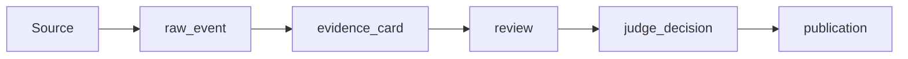
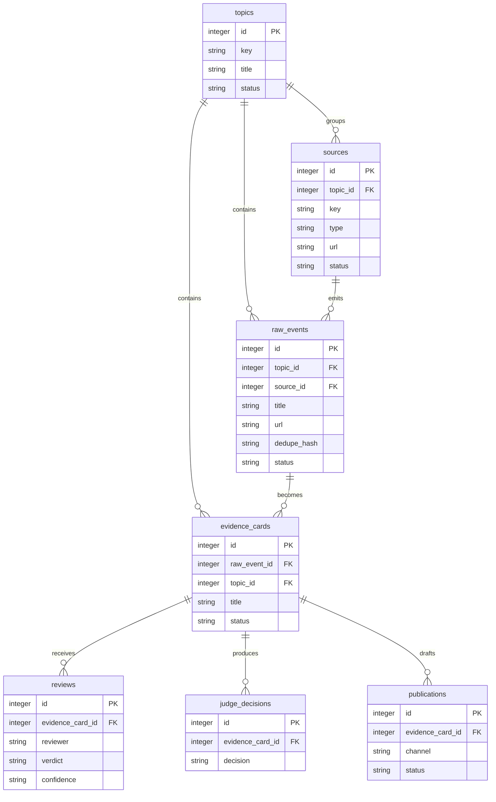

# Architecture

Agent Evidence Board is intentionally small. It uses SQLite as the durable ledger and deterministic validators as the publication boundary.

## Pipeline

## Entity Relationships

## Tables

- `topics`: broad research areas.
- `sources`: public sources connected to a topic.
- `raw_events`: captured source material or user-provided signals.
- `evidence_cards`: structured claims with source references.
- `reviews`: human or agent review output.
- `judge_decisions`: deterministic gate result.
- `publications`: draft or published outputs.

## Invariants

- A claim must reference a known source.
- Concrete X/Twitter post cards should not publish from preview-only text.
- Stale social sources should be blocked or refreshed.
- Secret-like values should block publication.
- Guarantee/trading-command language should block publication.
- Reviews can add warnings or blockers, but deterministic source checks should not be skipped.

## Source Capture

The default capture layer is public and bounded:

1. Direct HTTP for ordinary public pages.
2. Public X/Twitter post endpoints where available for concrete status URLs.
3. Jina Reader as a fallback for public pages.

The project does not include authenticated browser profiles, cookies, private APIs, or platform bypasses.

## Why SQLite

SQLite keeps the first version easy to run, inspect, back up, and test. If a deployment needs concurrent writers, distributed workers, or larger retention windows, the table model can later move to Postgres.
